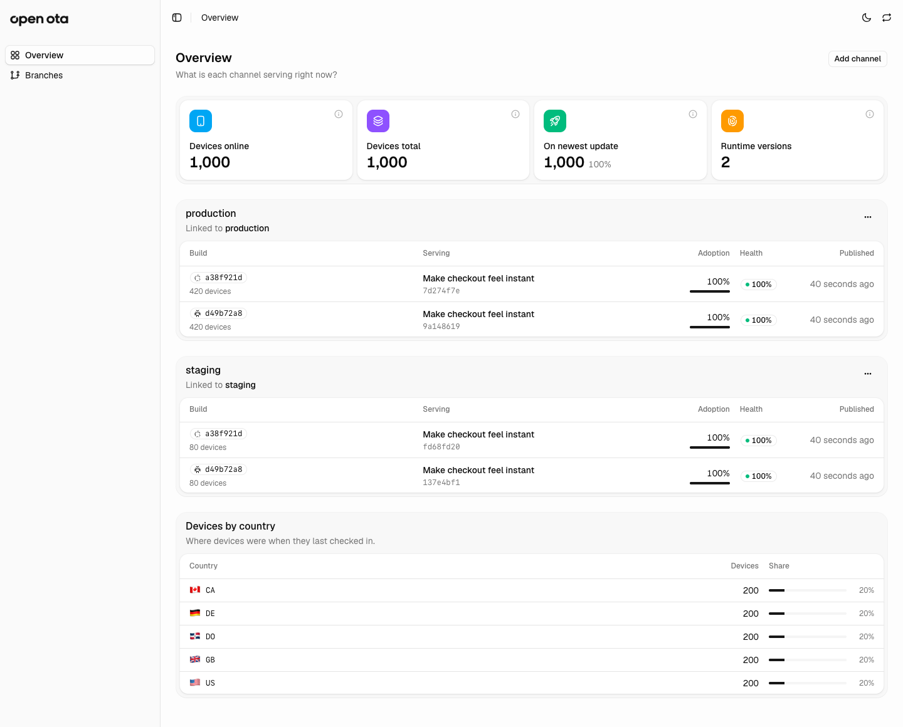
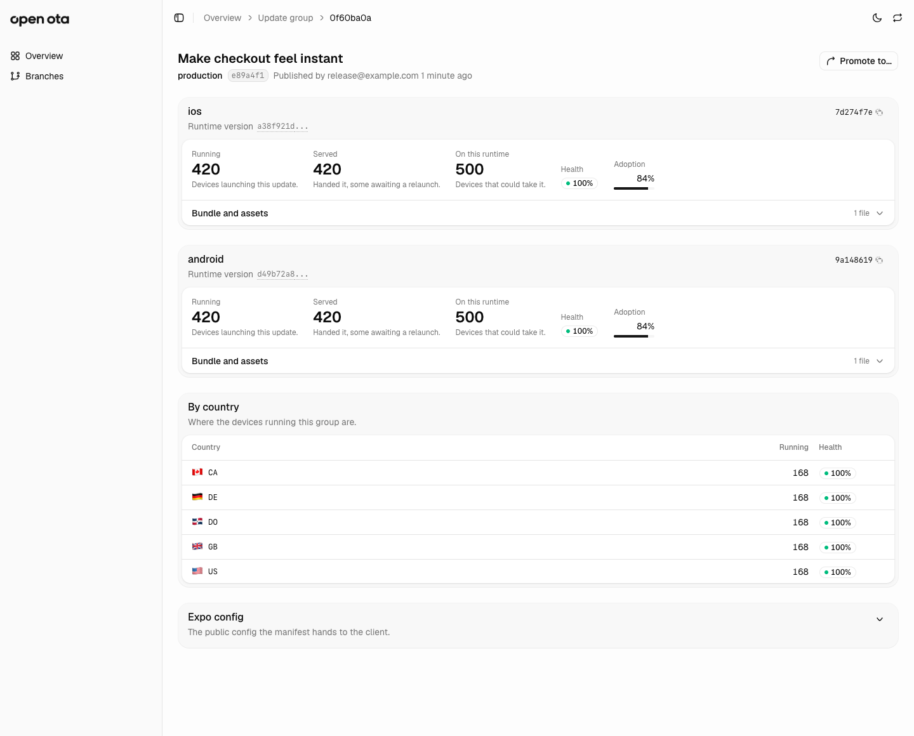
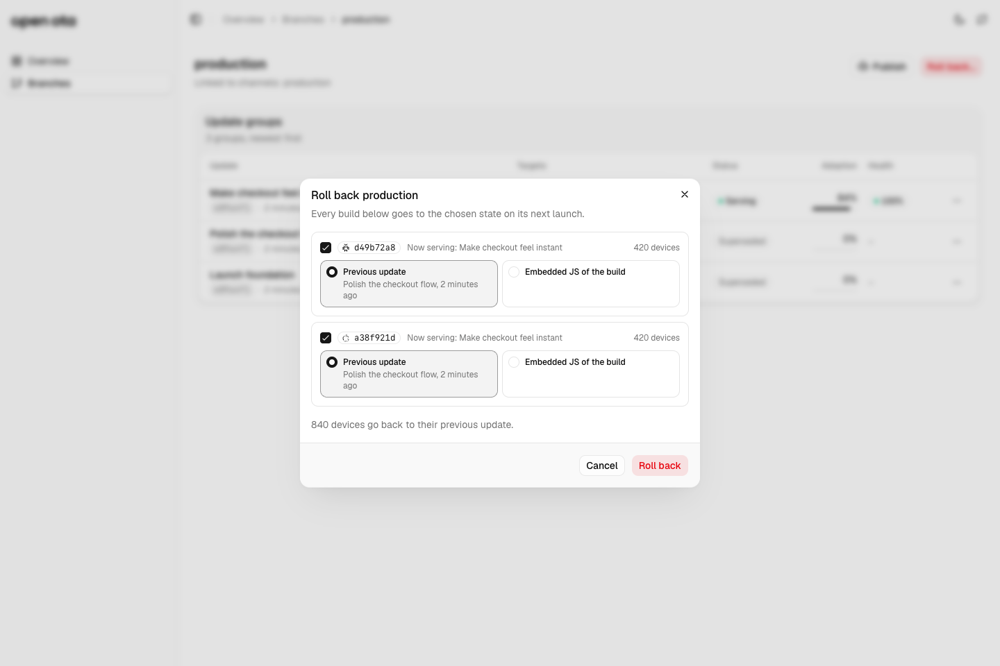

<h1 align="center">
  <picture>
    <source media="(prefers-color-scheme: dark)" srcset="./assets/open-ota-wordmark-light.png">
    
  </picture>
</h1>

<p align="center">Self-hosted over-the-air updates for Expo apps, running entirely on Cloudflare.</p>

Publish JavaScript and asset updates to your Expo app from your own Cloudflare account.
Use the CLI to publish, then manage channels, gradual rollouts, and rollbacks in the dashboard.
Open OTA uses the standard `expo-updates` client and does not require EAS Update.

<picture>
  <source media="(prefers-color-scheme: dark)" srcset="./assets/screenshots/dashboard-overview-dark.png">
  
</picture>

<details>
<summary>Explore the dashboard: release health and rollbacks</summary>

### Release health

Inspect each platform's runtime, running and served devices, adoption, assets, and country breakdown.

<picture>
  <source media="(prefers-color-scheme: dark)" srcset="./assets/screenshots/dashboard-release-dark.png">
  
</picture>

### Rollbacks by native build

Choose the previous update or embedded JavaScript for each build, with the affected device count visible before confirming.

<picture>
  <source media="(prefers-color-scheme: dark)" srcset="./assets/screenshots/dashboard-rollback-dark.png">
  
</picture>

</details>

## Features

- **Signed updates.** Apps verify manifests and rollback directives against the certificate embedded in their native build.
- **Channels and branches.** Keep staging and production in one deployment, with separate update streams.
- **Gradual rollouts.** Start with a percentage of devices and increase it to 100%. The server prevents overlapping rollouts for the same branch, platform, and runtime, including concurrent publishes.
- **Rollbacks.** Return each build to its previous update or embedded JavaScript from the dashboard.
- **Setup and diagnostics.** `open-ota init` configures your app; `open-ota doctor` checks configuration, credentials, runtimes, and server signatures. Publish runs these checks before exporting.
- **Efficient delivery.** Content-addressed assets are deduplicated and cached at the edge. bsdiff delta patches are computed at publish time against the bundles devices actually run, including the JavaScript embedded in store builds, verified by the server before they are stored, and kept only when they beat the compressed download. Full bundles are always the fallback, and a nightly sweep removes bundles nothing references.
- **Device health.** See reported update adoption, failed updates, runtime versions, and country breakdowns from client check-ins, without adding a separate telemetry SDK.
- **Your infrastructure.** Workers, D1, R2, Analytics Engine, and a dashboard protected by Cloudflare Access, deployed together with Alchemy.

## Quick start

You'll need:

- A Cloudflare account with Workers, D1, R2, Analytics Engine, and Access. [Usage charges apply](https://developers.cloudflare.com/workers/platform/pricing/).
- Node.js 24+ and pnpm 10 to deploy this repository. The published CLI needs Node.js 20+.
- An Expo app using `expo-updates`. Any client speaking Expo Updates protocol version 1 works; development targets SDK 57.

### 1. Deploy Open OTA

```sh
git clone https://github.com/focux/open-ota.git
cd open-ota
pnpm install --frozen-lockfile
pnpm cloud:login

# Writes .keys/private-key.pem and certs/certificate.pem
npx expo-updates codesigning:generate \
  --key-output-directory .keys \
  --certificate-output-directory certs \
  --certificate-validity-duration-years 10 \
  --certificate-common-name "Your App"

cp .env.example .env
```

Fill in `.env`:

| Variable | Value |
| --- | --- |
| `OTA_PUBLISH_TOKEN` | **Required.** A long random secret, such as the output of `openssl rand -hex 32`. |
| `OTA_SIGNING_KEY` | **Required.** Contents of `.keys/private-key.pem`, double-quoted with newlines escaped as `\n`. |
| `OTA_ACCESS_EMAILS` | Emails allowed into the dashboard, comma separated. |
| `OTA_ACCESS_EMAIL_DOMAINS` | Email domains allowed into the dashboard, comma separated. |
| `OTA_UPDATES_DOMAIN` | Updates hostname, such as `updates.example.com`. Omit for a `workers.dev` URL. |
| `OTA_DASHBOARD_DOMAIN` | Dashboard hostname, such as `ota.example.com`. Omit for a `workers.dev` URL. |
| `OTA_PATCH_MAX_RATIO` | Largest patch worth storing, as a share of the compressed bundle download. Default `0.3`. |
| `OTA_PATCH_MAX_BUNDLE_MB` | Bundles above this get no patches, since the Worker verifies each one in memory. Default `32`. |
| `OTA_RETAIN_GROUPS`, `OTA_RETAIN_DAYS`, `OTA_RETAIN_DEVICE_DAYS` | What the nightly sweep keeps. Defaults `20`, `30`, `90`. See [Delta patches and retention](#delta-patches-and-retention). |
| `OTA_DELIVERY_STATS` | Set to `off` to skip minting the analytics-only API token the dashboard's download counts use, for deploy credentials that cannot create tokens. |

Set at least one of the two Access lists; either one grants access, and every stage that is not a
`dev_` stage refuses to deploy without one. Custom hostnames must belong to a zone in your account.
Access protects the dashboard only, never the update traffic devices depend on.

Then deploy:

```sh
pnpm cloud:deploy:prod
```

Save the printed `updatesUrl` and `dashboardUrl`, then open the dashboard and sign in through
Cloudflare Access. The first migration creates the `staging` and `production` channels, each linked
to its matching branch.

> [!IMPORTANT]
> Back up `.keys/private-key.pem`. Installed builds trust only its certificate, so losing it means a
> new native build for every user. This repository ignores `.keys/` and `.env`; keep both out of your
> app and out of source control. See [Expo's signing
> documentation](https://docs.expo.dev/eas-update/code-signing/) for certificate lifecycle details.

### 2. Connect your app

Run this in **your Expo app repository**, using its own package manager:

```sh
npx expo install expo-updates
npm install --save-dev --save-exact open-ota

# Commit the certificate that matches the key you deployed with
cp /path/to/open-ota/certs/certificate.pem certs/certificate.pem

export OTA_URL="https://updates.example.com"   # your updatesUrl, without /manifest
export OTA_PUBLISH_TOKEN="your-publish-token"

npx open-ota init --channel staging
```

The CLI reads those variables from your shell and does not load `.env` files.

`init` writes the update URL, channel, signing settings, and fingerprint runtime policy into
`app.json`, preserves unrelated settings, saves `app.json.open-ota.bak`, and runs `doctor`. With a
dynamic `app.config.ts`, it prints the fields to merge instead of editing the file; apply them with
your own channel selection and then run `npx open-ota doctor`.

Now create a release native build and install it on a device. The URL, channel, and certificate are
native settings: changing any of them needs a new build. If you maintain native projects by hand,
apply the matching native configuration too, since `init` only edits Expo app config.

### 3. Publish an update

Make a JavaScript change, then:

```sh
npx open-ota publish --branch staging --message "Fix payment sheet"
```

That checks the app and server, exports both platforms, resolves their runtime versions, uploads
missing assets, and publishes one update group. Add `--platform ios` or `--platform android` to
publish a single platform.

Open the installed app and let it check on its own update policy, then confirm the change on the
device and its reported update in the dashboard. A passing `doctor` proves connectivity and signing;
it does not prove that a device loaded anything.

To release gradually, start a canary and raise its percentage from the dashboard:

```sh
npx open-ota publish --branch staging --rollout 10 --message "Try new checkout"
```

Finish the rollout at 100%, or use **Roll back**, before publishing again for that branch, platform,
and runtime. Promote a tested group to `production` when ready; production builds must check the
`production` channel with a matching runtime version.

Delta patches need nothing installed: the CLI ships the bsdiff engine as WebAssembly. Patches are
computed and verified on the publishing machine, verified again by the server, and uploaded before
the update group is published, so no device can fetch a new bundle before its patches exist.
`--no-patches` skips them, and `open-ota patches` computes whatever a branch is missing later.

See the [CLI reference](packages/cli/README.md) for rollback commands, `--json` output, verbosity,
shell completions, and every flag.

## Publishing from CI

Install the app's dependencies from its committed lockfile, including the pinned `open-ota` dev
dependency. Then add a publish step to your existing app workflow:

```yaml
- name: Publish staging update
  run: npx open-ota publish --branch staging --message "$UPDATE_MESSAGE"
  working-directory: apps/mobile
  env:
    OTA_URL: ${{ vars.OTA_URL }}
    OTA_PUBLISH_TOKEN: ${{ secrets.OTA_PUBLISH_TOKEN }}
    UPDATE_MESSAGE: ${{ github.event.head_commit.message }}
```

Adjust `working-directory` to your app. Store `OTA_URL` as a repository variable and
`OTA_PUBLISH_TOKEN` as a secret. Use the same native dependencies and relevant configuration as the
installed build: a different fingerprint targets a different runtime. CI must also select the same
app configuration used by that build, including any environment variables your dynamic config needs.

Progress goes to stderr. Add `--json` for a machine-readable result on stdout; fatal errors exit
with status 1. `--server` and `--token` override the environment, and `OTA_ACTOR` overrides the
commit author recorded for a publish.

## How updates are selected

A native build checks a **channel**, which points to a **branch**. Each publish adds an **update
group** containing an update for each selected platform and its runtime version.

On a check, the Updates Worker selects compatible updates from D1 and applies the rollout percentage.
It returns a manifest or directive, signed when the configured client requests a signature. Clients
download assets from R2 through Workers Cache. Rollout percentages only increase; devices outside a
canary keep the previous compatible update, or receive none if there is no compatible update, and
devices without a client ID stay on that fallback until the rollout reaches 100%. The dashboard calls the Worker through a service
binding; publishing and admin endpoints require the publish token.

### Caching

Workers Cache runs in front of the Worker, with cross-version caching on so entries survive a deploy
rather than going cold on every release.

Nothing about a publish waits on it, and there is nothing to purge. Manifests and rollback
directives are returned `private, max-age=0`, so a new update, a raised rollout percentage, or a
rollback reaches each device on its next check.

Full assets are the only cached responses: `public, max-age=31536000, immutable` with a
`cache-tag: asset`. They are content-addressed, so a URL can never change its bytes, and a cache hit
is served at the edge without invoking the Worker or reading R2. They `Vary` on `A-IM` and
`Expo-Current-Update-ID`, so a cached full bundle cannot shadow a bsdiff patch for a device on a
different base update.

A patch is fixed by the bundle it targets and the update it applies to, which is exactly what the
cache key varies on, so patches are cached like bundles: `public, max-age=31536000, immutable`. The
one answer that can change is a full bundle served to a device that asked for a patch before one
existed for its base; that answer is held for five minutes. Everything else the Worker returns is
`no-store` by default.

## Delta patches and retention

A device that already runs one update asks for the next bundle with `A-IM: bsdiff` and the id of
what it runs. When the server has a patch for that pair it answers `226` with the patch, and the
`expo-updates` client rebuilds the bundle, checks its hash, and falls back to a full download if
anything is off.

**Which bases get a patch.** On publish, the CLI asks the server which bundles are worth diffing
against, and the server answers from what it knows: the bundles devices on that platform and
runtime reported running in the last 30 days, on any branch, most devices first with the branch's
own devices breaking ties; then the embedded bundles of registered builds; then the most recent
publishes on the branch. Devices on other branches count because patches belong to bundles, not
branches: a group published to `early-access` and later promoted to `production` arrives there with
its patches already computed for the production fleet. Up to eight distinct bundles per platform,
and the newest bundle never patches against itself.

**When a patch is kept.** The launch asset is JavaScript, which Cloudflare compresses at the edge,
so a patch competes with the gzipped bundle, not the raw one. The server measures the compressed
size at upload and stores a patch only when it is at most `OTA_PATCH_MAX_RATIO` of that size. The
CLI applies the same rule before uploading. Bundles above `OTA_PATCH_MAX_BUNDLE_MB` get no patches.

**Trust.** The CLI applies each patch it computed and checks the result before uploading. The server
applies it again with the same engine and refuses to store anything that does not rebuild the
target bundle byte for byte. Devices verify the manifest hash as always.

**Registered builds and fresh installs.** `open-ota build register` records a native build by
platform, runtime, profile, distribution and channel. CI can use `open-ota build get` to decide
whether a compatible build already exists without waiting for a device to launch it. A build that
was pulled or rejected can be taken out of that decision with `open-ota build deactivate`; its
record and bundle stay. Registration also uploads the build's embedded bundle so fresh installs can
receive delta patches from it. Device verification of that fresh-install patch path is still
pending; see the [CLI reference](packages/cli/README.md#build-registry).

**Retention.** A sweep runs nightly (`17 3 * * *` UTC) and can be run from the dashboard API with
`POST /admin/gc`. It deletes bundles, assets and patches that nothing retained references. Retained
means: the newest `OTA_RETAIN_GROUPS` groups on each branch, any group younger than
`OTA_RETAIN_DAYS`, any update a device reported running or receiving within `OTA_RETAIN_DEVICE_DAYS`,
any active rollout, any bundle registered with a native build, and anything
uploaded or checked in the last day, since a publish may still be in flight. An update whose bundle was swept stays in the history
but is no longer offered as a rollback target.

**Visibility.** Each update in the dashboard lists the patches stored toward its bundle, which
updates or builds they apply to, and their share of the full download. It also shows how many
downloads took a patch over the last week and the bytes that saved. Those counts come from the
Analytics Engine SQL API, which has no Worker binding, so the deploy mints an account API token
scoped to reading analytics and binds it to the Worker as a secret. Deploying needs a credential
allowed to create tokens; set `OTA_DELIVERY_STATS=off` to skip it.

## Scope

One deployment serves one app across its channels. Native code changes require a new build.
Multi-app hosting, per-device targeting, and percentage splits between branches are outside the
current scope.

## Data and observability

The dashboard reflects device check-ins, rather than continuous activity. Open OTA stores client
IDs, platform and runtime versions, channels, current/embedded/served update IDs, check-in timestamps,
country and city when available, recent check history per device, and update failure reports. Check
and asset events are also written to Analytics Engine. These records live in your Cloudflare account. Asset events carry the bytes
served, which is where the per-update delivery counts in the dashboard come from.

Failure information depends on what `expo-updates` reports on subsequent checks. It is not a complete
crash-reporting service. Analytics Engine events are collected, but historical time-series charts
are not yet exposed in the dashboard.

## Development

Follow the deployment setup above to authenticate with Cloudflare and configure `.env` before
starting the local stack.

```sh
pnpm install --frozen-lockfile
pnpm dev                       # local stack with hot reload
pnpm check                     # typechecks and dashboard formatting
pnpm --filter dashboard lint
pnpm test
pnpm build
```

Local development uses a `dev_<user>` stage; custom domains are ignored there. Production deploys
require an Access allow-list. Changes to infrastructure and ordered D1 migrations are managed by
Alchemy. Preview a production deploy with `pnpm cloud:plan --stage production`.

See [CONTRIBUTING.md](CONTRIBUTING.md) for the CLI release process.

Tests cover the Worker with memory and SQLite stores, the CLI, and the dashboard. Patch tests
require `bspatch` on PATH, provided by the `bsdiff` package on Debian/Ubuntu. CI runs checks, lint,
tests, and builds on pull requests and pushes to `main`.

| Path | Contents |
| --- | --- |
| `alchemy.run.ts` | Cloudflare stack composition |
| `apps/updates` | Updates Worker, storage, signing, and D1 migrations |
| `apps/dashboard` | TanStack Start dashboard |
| `apps/landing` | Project website, deployed separately from the self-hosted stack |
| `packages/cli` | Effect-based `open-ota` CLI |

## Troubleshooting

Start with `npx open-ota doctor --verbose` from the app directory, using the same
environment variables as its native build.

| Symptom | What to check |
| --- | --- |
| Publish succeeds but the app stays on an older update | Confirm the installed build's channel points to the published branch and that its platform and runtime match. Check the rollout percentage and allow the app to download and load the update according to its update policy. |
| Doctor reports no observed devices | This is expected before the first device check-in. Install a build configured for this server and check again; doctor probes do not register devices. |
| Authentication or signature checks fail | Match `OTA_URL` and `OTA_PUBLISH_TOKEN` to the deployment, and use the certificate matching its signing key. Keep the updates hostname outside Cloudflare Access. |
| Publishing is blocked by an active rollout | Complete the existing rollout at 100% or use the dashboard's **Roll back** action for the affected build. |
| Init cannot create its backup | Review and keep or rename `app.json.open-ota.bak` before retrying. Init never overwrites an existing backup. |

### One device is not getting the update

The dashboard's **Devices** page answers this from what the server actually decided, rather than from
guesswork. Search by the `eas-client-id` the app reports, or narrow the fleet by platform, runtime
version, channel, running update, country, or last seen. The device page shows its current state and
its recent checks, each with the reason behind the answer. Work down these in order; the first one
that matches is the answer.

| What you see | What it means |
| --- | --- |
| The device is not there at all | The app is not reaching this server. Check `OTA_URL` in the build, network access to the updates hostname, and that the hostname is not behind Cloudflare Access. |
| **Unknown channel** | The build asks for a channel no branch is linked to. Link that channel to a branch, or ship a binary built for a channel that exists. |
| **No update for runtime** | Nothing published on the branch targets the runtime version in the native binary. Publish for that runtime, or ship a new binary. |
| **Rollout excluded** | Expected. The newest update is on a partial rollout and this device is outside it. Raise the rollout percentage to include it. |
| **Already current** | Nothing is wrong: the device runs the newest update the branch serves. |
| Served is ahead of running | The update was downloaded and is waiting for a full relaunch. `expo-updates` does not apply one on a return from the background. |

Each device keeps its last 20 answers. A run of identical ones is a single entry with a count, and a
repeat within a minute of the last write is not recorded at all, so the list shows the transitions
that explain the device rather than the last few minutes of polling. Nothing here needs configuring.

A device that has not checked in for a year is forgotten by the nightly sweep, along with its checks
and failure reports: it reappears on its next check-in, and until then it is out of the device counts
and the adoption denominators, which is what keeps a long-dead install from diluting them.

## License

[MIT](LICENSE).
